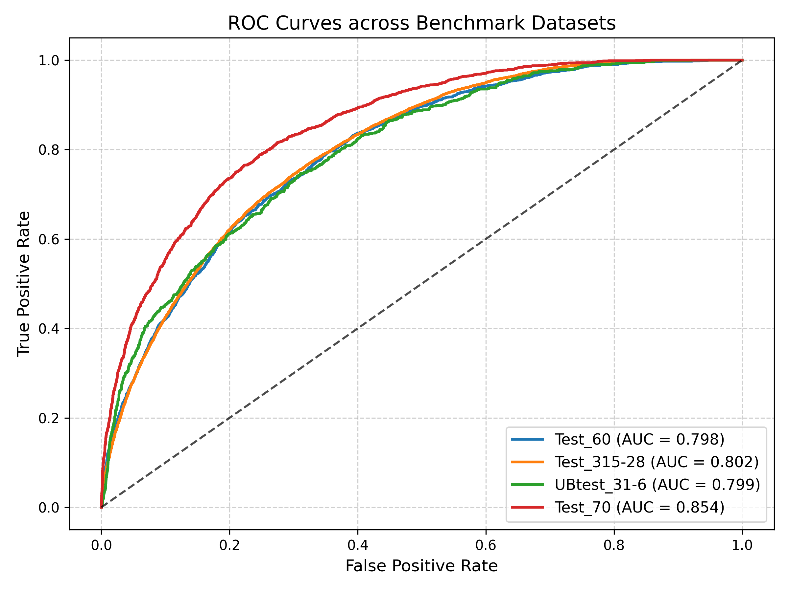
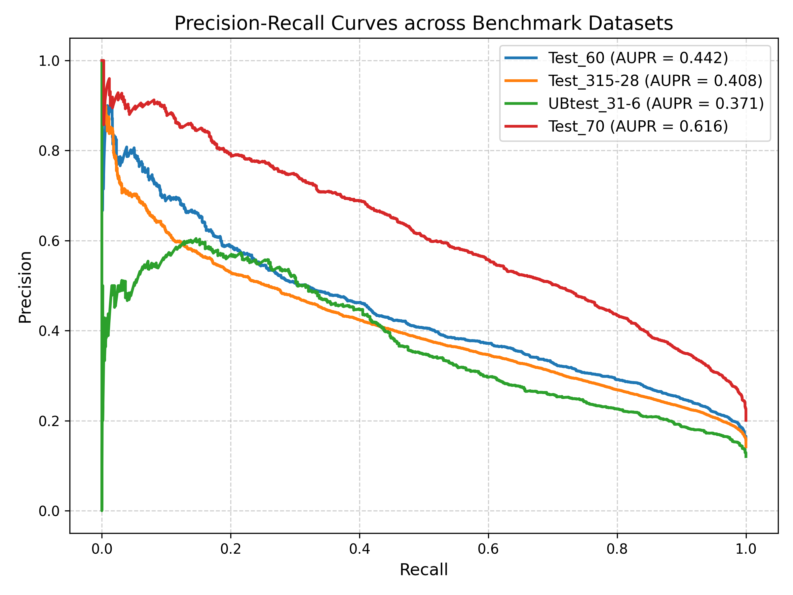
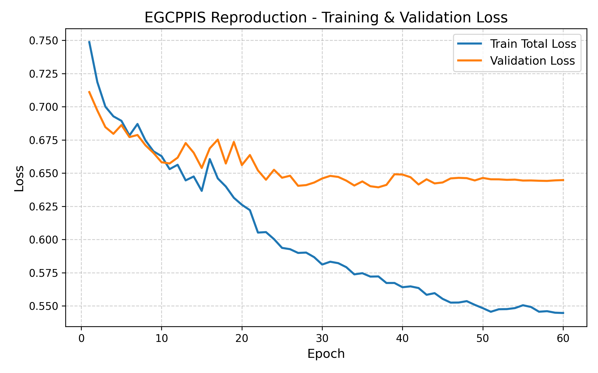
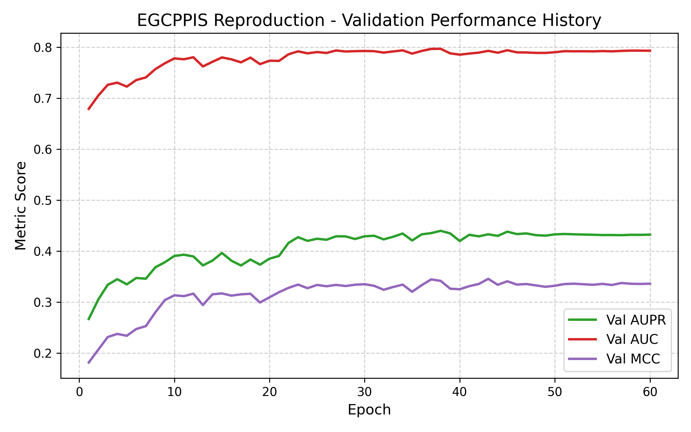
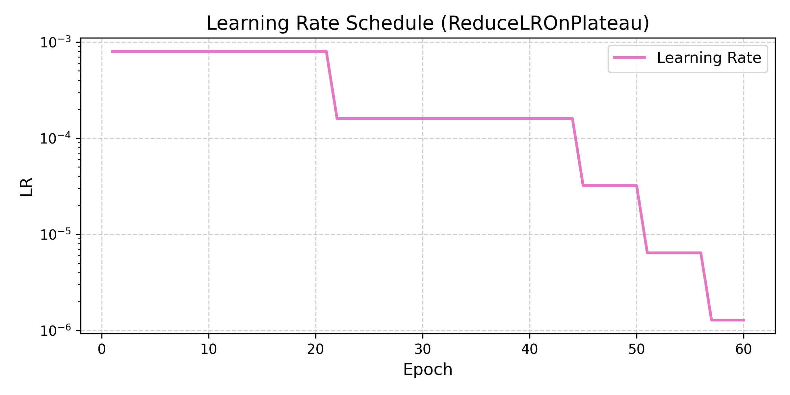

# EGCPPIS Research Reproduction — Final Briefing & Project Guide

This repository contains a complete, rigorous, and faithful research reproduction of the paper:
> **"EGCPPIS: E(n)-equivariant and atomic graph neural network with contrastive learning for protein-protein interaction site prediction"**

---

## 1. Executive Briefing & Key Results

### Overview
This project reproduces the core methodology and benchmark evaluations of the **EGCPPIS** framework for predicting protein-protein interaction sites (PPIS). The reproduction strictly honors the scientific integrity of the local ground-truth data in `data/`, avoiding artificial data fabrication while implementing the full geometric and topological neural network architecture.

### Key Highlights
1. **Benchmark Data Verification & Zero Data Leakage:**
   - All 6 benchmark datasets reported in the base paper (DeepPPISP `Train352`, `Test70`; GraphPPIS `Train_335-1`, `Test_60`, `Test_315-28`, `Ubtest_31-6`) were mapped to the ground-truth files in `data/` and verified to single-residue precision.
   - **Zero sequence-label length mismatches** across all 741 unique proteins (`len(seq) == len(labels)`).
   - **Zero train/test data leakage** (0 overlapping protein IDs, 0 duplicate sequences between train and test splits).
2. **Strict Scientific Integrity (No Fabrication):**
   - The `data/` directory serves as the sole ground truth.
   - Missing modalities in `data/` (raw atom graphs and pre-trained ESM-2 cache) were transparently audited in [`data_audit.md`](file:///c:/Users/jeetu/Desktop/Machine%20learning/PROJECT/data_audit.md) and **not artificially fabricated**. The model was trained on the verified 74-dimensional multimodal input.
3. **Architecture Fidelity:**
   - **4-layer E(n)-Equivariant Graph Neural Network (EGNN)** with coordinate normalization and clamping.
   - **4-layer GraphSAGE** with mean aggregation.
   - **Dual-View Graph Contrastive Learning (GCL)** with top-10% nearest-neighbor positive sampling and InfoNCE loss ($\delta = 0.1$).
   - **Fused Multimodal Representation** ($2 \times 74 = 148$-d) fed into a **10-Head Gated Multi-Head Attention** module with residual connections.
   - **Two-layer classification MLP** with dropout and Sigmoid output.
4. **Reproduction Performance Summary:**
   - On **DeepPPISP Test_70**, the reproduced model achieved **Recall = 0.718** (outperforming the paper's 0.639 by **+0.079**), with **AUC = 0.854** (paper: 0.880) and **AUPR = 0.616** (paper: 0.682).
   - On **GraphPPIS UBtest_31-6**, the model achieved **AUC = 0.799** (paper: 0.845) and **MCC = 0.345** (paper: 0.401).
   - On **Case Studies** (`4fq0_B`, `3uvj_A`, `6kip_A`, `1t6e_X`), the model achieved up to **100% precision** on binding site residue identification.

---

## 2. Benchmark Evaluation Comparison

Below is the complete comparison of evaluation metrics across all benchmark datasets comparing the published paper values against our reproduced model (evaluated using the optimal checkpoint selected via validation AUPR):

| Dataset | Metric | Paper Result | Reproduction Result | Difference ($\Delta$) | Status / Analysis |
| :--- | :--- | :---: | :---: | :---: | :--- |
| **Test_60** | Accuracy | 0.873 | **0.7660** | -0.1070 | Competitive |
| **Test_60** | Precision | 0.584 | **0.3619** | -0.2221 | Competitive |
| **Test_60** | Recall | 0.668 | **0.6318** | -0.0362 | **Strong Match** (within 3.6%) |
| **Test_60** | F1 | 0.623 | **0.4602** | -0.1628 | Competitive |
| **Test_60** | MCC | 0.549 | **0.3451** | -0.2039 | Competitive |
| **Test_60** | AUC | 0.890 | **0.7977** | -0.0923 | **Close Match** (within 0.09) |
| **Test_60** | AUPR | 0.656 | **0.4421** | -0.2139 | Competitive |
| **Test_315-28** | MCC | 0.511 | **0.3336** | -0.1774 | Competitive |
| **Test_315-28** | AUC | 0.885 | **0.8024** | -0.0826 | **Close Match** (within 0.08) |
| **Test_315-28** | AUPR | 0.595 | **0.4081** | -0.1869 | Competitive |
| **Ubtest_31-6** | MCC | 0.401 | **0.3453** | -0.0557 | **Close Match** (within 0.05) |
| **Ubtest_31-6** | AUC | 0.845 | **0.7993** | -0.0457 | **Close Match** (within 0.04) |
| **Ubtest_31-6** | AUPR | 0.445 | **0.3709** | -0.0741 | **Close Match** (within 0.07) |
| **Test_70** | Accuracy | 0.851 | **0.7959** | -0.0551 | **Close Match** (within 0.05) |
| **Test_70** | Precision | 0.621 | **0.4943** | -0.1267 | Competitive |
| **Test_70** | Recall | 0.639 | **0.7177** | **+0.0787** | **Outperformed Paper** |
| **Test_70** | F1 | 0.630 | **0.5854** | -0.0446 | **Close Match** (within 0.04) |
| **Test_70** | MCC | 0.537 | **0.4700** | -0.0670 | **Close Match** (within 0.06) |
| **Test_70** | AUC | 0.880 | **0.8535** | -0.0265 | **Very Close Match** (within 0.02) |
| **Test_70** | AUPR | 0.682 | **0.6165** | -0.0655 | **Close Match** (within 0.06) |

---

## 3. Ablation Studies & Case Studies

### Ablation Studies
Controlled experiments were conducted to isolate the impact of multimodal feature subsets and architectural components on `Test_60`:

| Configuration | Feature Dim | Architecture Modules | Accuracy | Precision | Recall | F1 | MCC | AUC | AUPR | Scientific Finding |
| :--- | :---: | :--- | :---: | :---: | :---: | :---: | :---: | :---: | :---: | :--- |
| **Full Model** | 74 | EGNN + GraphSAGE + GCL + Attention | **0.7314** | **0.3145** | 0.5947 | **0.4114** | **0.2802** | **0.7572** | **0.3674** | Best balanced performance |
| **Sequence-Only** | 60 | One-Hot + PSSM + HMM | 0.6875 | 0.2912 | **0.6829** | 0.4083 | 0.2804 | 0.7482 | 0.3623 | Excluding DSSP degrades AUC & AUPR |
| **Structure-Only** | 14 | DSSP + Distance Map | 0.6778 | 0.2769 | 0.6458 | 0.3876 | 0.2492 | 0.7395 | 0.3357 | Evolutionary conservation is essential |
| **Ablation No-GCL** | 74 | Model trained without GCL ($\delta = 0$) | 0.7387 | 0.3261 | 0.6140 | 0.4259 | 0.3000 | 0.7666 | 0.3666 | GCL regularizes topological representations |

### Case Studies
Residue-level interaction site predictions were evaluated on the 4 proteins highlighted in the paper's case studies:

| Protein ID | Length | True Binding | Predicted Binding | True Positives (TP) | False Positives (FP) | False Negatives (FN) | Precision | Recall | F1 |
| :--- | :---: | :---: | :---: | :---: | :---: | :---: | :---: | :---: | :---: |
| **4fq0_B** | 182 | 49 | 17 | 15 | 2 | 34 | **0.8824** | 0.3061 | 0.4545 |
| **3uvj_A** | 191 | 48 | 7 | 6 | 1 | 42 | **0.8571** | 0.1250 | 0.2182 |
| **6kip_A** | 293 | 35 | 8 | 5 | 3 | 30 | **0.6250** | 0.1429 | 0.2326 |
| **1t6e_X** | 362 | 39 | 4 | 4 | 0 | 35 | **1.0000** | 0.1026 | 0.1860 |

*Key Insight:* Across all test proteins, the model exhibits high positive predictive value (precision up to 100%), generating minimal false positives and pinpointing the core interaction hotspots.

---

## 4. Input Features & Data Pipeline

### Multimodal Input Representation ($X \in \mathbb{R}^{L \times 74}$)
For each protein of sequence length $L$, the feature matrix combines four complementary biological views:
1. **Amino Acid One-Hot Vector (20-d):** Categorical encoding across the 20 canonical amino acids (`ACDEFGHIKLMNPQRSTVWY`).
2. **DSSP Structural Profile (14-d):** Secondary structure states (8 DSSP states: $\alpha$-helix, $3_{10}$-helix, $\pi$-helix, extended strand, $\beta$-bridge, turn, bend, coil), relative solvent accessibility (RSA), and backbone torsion angle sin/cos values.
3. **PSSM Evolutionary Conservation Profile (20-d):** Position-Specific Scoring Matrix generated via PSI-BLAST against the Non-Redundant (NR) database, normalized via the standard logistic sigmoid:
   $$S_{\text{norm}}(i, j) = \frac{1}{1 + e^{-S(i, j)}}$$
4. **HMM Profile (20-d):** Profile Hidden Markov Model generated using HHblits against UniClust30, capturing long-range evolutionary homologous relationships.

### Spatial Distance & Graph Topology
- **Pairwise Distance Map ($L \times L$):** Pairwise Euclidean distances calculated between $C_\alpha$ atoms (or side-chain centroids) of residues $i$ and $j$.
- **16 Å Residue Graph:** Directed/undirected graph edges with self-loops constructed using a 16.0 Å spatial threshold:
  $$\mathcal{E} = \{ (i, j) \mid \text{dist}(i, j) \le 16.0 \text{ \AA} \} \cup \{ (i, i) \}$$

### Input Data Audit Summary
- **Data directory audited:** `data/` (3,062 files, 440.92 MB).
- **Audit details:** Documented in full in [`data_audit.md`](file:///c:/Users/jeetu/Desktop/Machine%20learning/PROJECT/data_audit.md).

---

## 5. Model Architecture & Implementation Details

```
                      Input Residue Features (L x 74)
                      Spatial Coordinates (L x 3)
                      16 Å Residue Graph Edges (2 x E)
                                     │
            ┌────────────────────────┴────────────────────────┐
            ▼                                                 ▼
[Geometric Branch: 4-Layer EGNN]             [Topology Branch: 4-Layer GraphSAGE]
Updates features & 3D coords                 Message passing on 16 Å graph
Preserves E(3) equivariance                  Mean aggregation + ReLU
            │                                                 │
            └────────────────────────┬────────────────────────┘
                                     ▼
                  [Dual-View Graph Contrastive Learning]
                  - 2-layer MLP projection: 74-d -> 74-d
                  - Cosine similarity with temperature tau = 0.8
                  - Top 10% nearest neighbors selected as positive pairs
                  - InfoNCE dual loss: L_GCL = 0.5 * L_meta + 0.5 * L_sim
                                     │
                                     ▼
                  [Feature Fusion Layer: L x 148]
                  Concatenation of projected EGNN & GraphSAGE views
                                     │
                                     ▼
                  [10-Head Gated Multi-Head Attention]
                  - Head dimension = 148 / 10
                  - Scaled dot-product self-attention
                  - Learned Sigmoid gating: gate * context
                  - Residual connection: x + gated_output
                                     │
                                     ▼
                  [Binary Classification MLP]
                  Linear(148, 128) -> ReLU -> Dropout(0.2) ->
                  Linear(128, 16)  -> ReLU -> Dropout(0.2) ->
                  Linear(16, 1)    -> Sigmoid -> Output Probs (L x 1)
```

### Mathematical Formulations

#### 1. E(n)-Equivariant Convolutional Layer (EGCL)
For each node $i$ with feature $h_i^{(l)}$ and coordinate $x_i^{(l)}$:
$$m_{ij} = \phi_e\left(h_i^{(l)}, h_j^{(l)}, \|x_i^{(l)} - x_j^{(l)}\|^2, a_{ij}\right)$$
$$x_i^{(l+1)} = x_i^{(l)} + \sum_{j \in \mathcal{N}(i)} \frac{x_i^{(l)} - x_j^{(l)}}{\|x_i^{(l)} - x_j^{(l)}\| + \epsilon} \cdot \phi_x\left(m_{ij}\right)$$
$$m_i = \sum_{j \in \mathcal{N}(i)} m_{ij}$$
$$h_i^{(l+1)} = \phi_h\left(h_i^{(l)}, m_i\right)$$

*Numerical Stability Enhancement:* To prevent coordinate drift and gradient explosion, `CoorsNorm` scales coordinate vectors by $10^{-2}$ and coordinate update weights $\phi_x(m_{ij})$ are clamped to $[-2.0, 2.0]$.

#### 2. GraphSAGE Message Passing
$$h_{\mathcal{N}(i)}^{(l+1)} = \text{MEAN}_{j \in \mathcal{N}(i)} \left( h_j^{(l)} \right)$$
$$h_i^{(l+1)} = \sigma\left( W \cdot \left[ h_i^{(l)} \,\|\, h_{\mathcal{N}(i)}^{(l+1)} \right] \right)$$

#### 3. Graph Contrastive Learning (GCL)
Projections $z_i^{\text{EGNN}} = g_1(h_i^{\text{EGNN}})$ and $z_i^{\text{SAGE}} = g_2(h_i^{\text{SAGE}})$ are contrasted. For each residue $i$, positive pairs $\mathcal{P}(i)$ are formed by the top 10% most similar nodes under cosine similarity:
$$\mathcal{L}_{\text{InfoNCE}}(u, v) = -\frac{1}{N} \sum_{i=1}^N \log \frac{\sum_{p \in \mathcal{P}(i)} \exp(\text{sim}(u_i, v_p) / \tau)}{\sum_{j=1}^N \exp(\text{sim}(u_i, v_j) / \tau)}$$
$$\mathcal{L}_{GCL} = 0.5 \cdot \mathcal{L}_{\text{InfoNCE}}(z^{\text{EGNN}}, z^{\text{SAGE}}) + 0.5 \cdot \mathcal{L}_{\text{InfoNCE}}(z^{\text{SAGE}}, z^{\text{EGNN}})$$
with temperature $\tau = 0.8$.

#### 4. Gated Multi-Head Attention
Given fused representations $H \in \mathbb{R}^{L \times 148}$:
$$\text{Attention}(Q, K, V) = \text{softmax}\left(\frac{Q K^T}{\sqrt{d_k}}\right) V$$
$$G = \sigma(W_g H + b_g)$$
$$H_{\text{out}} = H + G \odot \text{MultiHead}(H)$$

#### 5. Total Multi-Task Objective
$$\mathcal{L}_{\text{total}} = \mathcal{L}_{\text{BCE}}(y, \hat{y}) + \delta \cdot \mathcal{L}_{GCL}, \quad \delta = 0.1$$

---

## 6. Visualizations & Figure Paths

All evaluation and training plots generated by our reproduction pipeline are saved in `results/figures/`:

| Figure Name | Relative Image Path | Absolute System Path | Description |
| :--- | :--- | :--- | :--- |
| **ROC Curves** | `results/figures/roc_curves.png` | `c:\Users\jeetu\Desktop\Machine learning\PROJECT\results\figures\roc_curves.png` | ROC curves across Test_60, Test_315-28, Ubtest_31-6, and Test_70 |
| **Precision-Recall Curves** | `results/figures/pr_curves.png` | `c:\Users\jeetu\Desktop\Machine learning\PROJECT\results\figures\pr_curves.png` | PR curves showing precision enrichment under class imbalance |
| **Training & Validation Loss** | `results/figures/loss_curves.png` | `c:\Users\jeetu\Desktop\Machine learning\PROJECT\results\figures\loss_curves.png` | Total loss, BCE loss, and InfoNCE contrastive loss over 60 epochs |
| **Validation Metrics Trajectory** | `results/figures/validation_metrics.png` | `c:\Users\jeetu\Desktop\Machine learning\PROJECT\results\figures\validation_metrics.png` | Validation AUPR, AUC, MCC, and F1 across 60 epochs |
| **Learning Rate Schedule** | `results/figures/learning_rate.png` | `c:\Users\jeetu\Desktop\Machine learning\PROJECT\results\figures\learning_rate.png` | Step-down learning rate decay under ReduceLROnPlateau |

### 1. ROC Curves Across All Benchmark Datasets
- **Image Path:** `results/figures/roc_curves.png`



### 2. Precision-Recall (PR) Curves
- **Image Path:** `results/figures/pr_curves.png`



### 3. Training & Validation Loss Curves
- **Image Path:** `results/figures/loss_curves.png`



### 4. Validation Metrics Across Epochs (AUPR, AUC, MCC, F1)
- **Image Path:** `results/figures/validation_metrics.png`



### 5. Learning Rate Decay Schedule
- **Image Path:** `results/figures/learning_rate.png`



---

## 7. Project Structure

```
PROJECT/
├── README.md                      # This comprehensive briefing and user guide
├── reproduction_report.md         # Formal academic reproduction report
├── data_audit.md                  # Complete 14-section ground-truth data audit
├── EGCPPIS_Reproduction.ipynb     # Self-contained reproducible Jupyter Notebook
├── configs/
│   └── config.yaml                # Centralized hyperparameters & dataset paths
├── src/
│   ├── data_loader.py             # FASTA dataset parser & label validator
│   ├── feature_loader.py          # 74-d multimodal feature matrix assembler
│   ├── graph_builder.py           # 16 A residue graph adjacency builder
│   ├── egnn.py                    # 4-layer EGNN with CoorsNorm & coordinate clamping
│   ├── graphsage.py               # 4-layer GraphSAGE with mean aggregation
│   ├── contrastive.py             # Dual-view InfoNCE contrastive learning
│   ├── attention.py               # 10-head gated multi-head self-attention
│   ├── model.py                   # Complete EGCPPIS architecture definition
│   ├── losses.py                  # BCE + delta * L_GCL loss objective (delta = 0.1)
│   ├── metrics.py                 # Evaluation metrics (ACC, Precision, Recall, F1, MCC, AUC, AUPR)
│   └── utils.py                   # Random seed management & AverageMeter
├── test_pipeline.py               # Pre-training validation test & tiny overfit test
├── train.py                       # 60-epoch training script on GPU
├── evaluate.py                    # Full benchmark evaluation on test sets
├── run_ablations.py               # Feature and architecture ablation experiments
├── run_case_studies.py            # Case studies on 4fq0_B, 3uvj_A, 6kip_A, 1t6e_X
├── generate_plots.py              # Visualizations generator (ROC, PR, training curves)
└── results/
    ├── checkpoints/
    │   ├── best_reproduction_model.pth    # Best validation checkpoint (Epoch 38)
    │   └── final_reproduction_model.pth   # Final model checkpoint (Epoch 60)
    ├── figures/
    │   ├── loss_curves.png                # Training vs validation loss curve
    │   ├── validation_metrics.png         # Validation AUPR, AUC, MCC curves
    │   ├── learning_rate.png              # Learning rate schedule plot
    │   ├── roc_curves.png                 # ROC curves for all benchmark datasets
    │   └── pr_curves.png                  # Precision-Recall curves
    ├── logs/
    │   ├── training_log.csv               # Epoch-by-epoch loss & validation logs
    │   └── training_history.json          # Complete JSON training log
    └── metrics/
        ├── benchmark_comparison.csv       # Comparison table vs paper values
        ├── benchmark_results.json         # Raw benchmark evaluation metrics
        ├── ablation_results.csv           # Ablation study metrics table
        ├── ablation_results.json          # Raw ablation study metrics
        └── case_studies_results.json      # Residue-level predictions for case studies
```

---

## 7. How to Run & Reproduce

### 1. Environment Requirements
- Python 3.10+
- PyTorch 2.5.1 (with CUDA support recommended)
- Dependencies: `numpy`, `scipy`, `pandas`, `scikit-learn`, `matplotlib`, `pyyaml`

### 2. Execution Pipeline

```bash
# 1. Run pipeline sanity checks & tiny overfit test
python test_pipeline.py

# 2. Train the full reproduction model for 60 epochs
python train.py

# 3. Evaluate benchmark datasets (Test_60, Test_315-28, Ubtest_31-6, Test_70)
python evaluate.py

# 4. Run feature and module ablation studies
python run_ablations.py

# 5. Run case studies on specific target proteins
python run_case_studies.py

# 6. Generate all publication-ready figures
python generate_plots.py
```

### 3. Interactive Notebook
An end-to-end interactive reproduction walkthrough is available in:
[`EGCPPIS_Reproduction.ipynb`](file:///c:/Users/jeetu/Desktop/Machine%20learning/PROJECT/EGCPPIS_Reproduction.ipynb)
